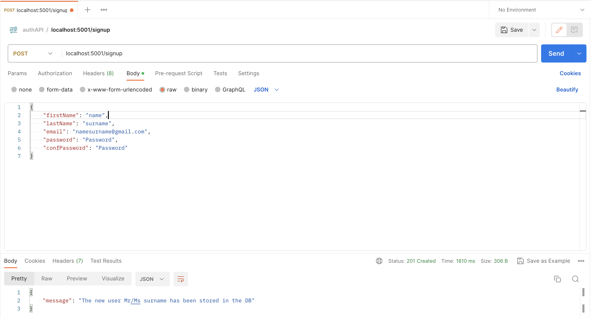
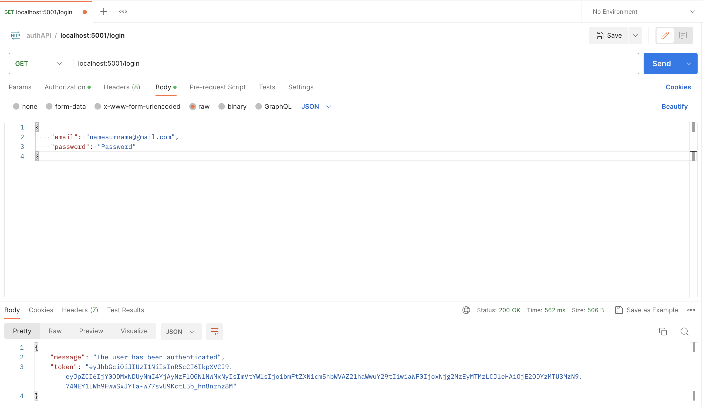

# AuthAPI

## Description

AuthAPI is a robust and secure back-end service, built using Node.js and Express.js, primarily designed to facilitate part of a JSON Web Token (JWT) authentication workflow.

This API provides multiple endpoints for user management and authentication:

- **User Registration**: The user registration endpoint allows new users to sign up by making a POST request with their credentials. The user's password is securely hashed using bcryptjs before it is stored in a MongoDB Atlas database.

- **User Login**: The user login endpoint facilitates existing users to authenticate themselves. Upon successful authentication, the server responds with a token, generated using the jsonwebtoken JavaScript package. This token can be used for subsequent authenticated requests to the server.

The application uses mongoose to model the user data and interact with the MongoDB Atlas service. Input validation on the server-side is performed using the express-validator package. Sensitive information, such as database credentials, is securely managed using the dotenv package.

The application code adheres to a consistent style and format, enforced by Prettier.

## Table of Contents

- [Installation](#installation)
- [Usage](#usage)
- [Technologies](#technologies)
- [Screenshots](#screenshots)
- [Contact](#contact)

## Installation

Before you begin, ensure you have met the following requirements:

### Prerequisites

- You have installed [Node.js and npm](https://nodejs.org/en/download/)
- You have a Windows/Mac/Linux machine.
- You have downloaded Postman (https://www.postman.com/downloads/)
- You have created a MongoDB cluster in MongoDB Atlas (https://www.youtube.com/watch?v=xrc7dIO_tXk)

### Installing

To install the project, follow these steps:

1. Clone the repository:

   ```
    git clone https://github.com/jparraporcar/jwt-authentication.git
   ```

2. Navigate into the project directory:

   ```
   cd jwt-authentication
   ```

3. Install dependencies:

   ```
   npm install
   ```

4. Create a `.env` file in the root directory of the project, and populate it with necessary environment variables. Refer to `.env.example` in the repository for the variables needed.

5. To start the server:
   ```
   npm start
   ```

## Usage

### User authentication

POST request to the endpoint /localhost:5001/signup (port number 5001 just as an example). Attach a json object as follows:

```
{
    "firstName": "name",
    "lastName": "surname",
    "email": "namesurname@gmail.com",
    "password": "Password",
    "confPassword": "Password"
}
```

The server will respond with a success message and the details of the registered user, excluding the password.

In case the email to be registered is already in the database there will be an error response

Note: The password must meet the following requirements: 8 characters minimum, 1 uppercase and 1 lowercase

### User login and token retrieval

To login and retrieve a token, make a POST request to /localhost:5001/login. Attach a JSON object as follows:

```
{
    "email": "namesurname@gmail.com",
    "password": "Password"
}
```

The server will respond with a JWT if the login is successful. Otherwise, it will return an error response.

Note: The token returned is just a dummy token and has no utility for any associated services

## Technologies

This project is implemented with the following technologies and libraries:

1. **Node.js**: An open-source, cross-platform, back-end JavaScript runtime environment that executes JavaScript code outside a web page.

2. **Express.js**: A minimal and flexible Node.js web application framework that provides a robust set of features for web and mobile applications.

3. **MongoDB**: A source-available cross-platform document-oriented database program. Classified as a NoSQL database program, MongoDB uses JSON-like documents with optional schemas.

4. **Mongoose**: An Object Data Modeling (ODM) library for MongoDB and Node.js. It manages relationships between data, provides schema validation, and is used to translate between objects in code and the representation of those objects in MongoDB.

5. **bcryptjs**: A library to help you hash passwords for securely carrying out, hashing and comparison.

6. **jsonwebtoken**: An implementation of JSON Web Tokens, which are an open, industry standard RFC 7519 method for representing claims securely between two parties.

7. **dotenv**: A zero-dependency module that loads environment variables from a `.env` file into `process.env`.

8. **express-validator**: A set of express.js middlewares that wraps validator.js validator and sanitizer functions.

9. **password-validator**: A library to provide a simple way to validate a password in JavaScript.

10. **nodemon**: A utility that will monitor for any changes in your source and automatically restart your server. This is used in a development environment.

## Screenshoots

<figure>
  <figcaption>This is a screenshot of the signup request/response in Postman.</figcaption>
  <br />
  
</figure>
<br />
<br />
<br />
<figure>
  <figcaption>This is a screenshot of the login request/response in Postman.</figcaption>
  <br />
  
</figure>
